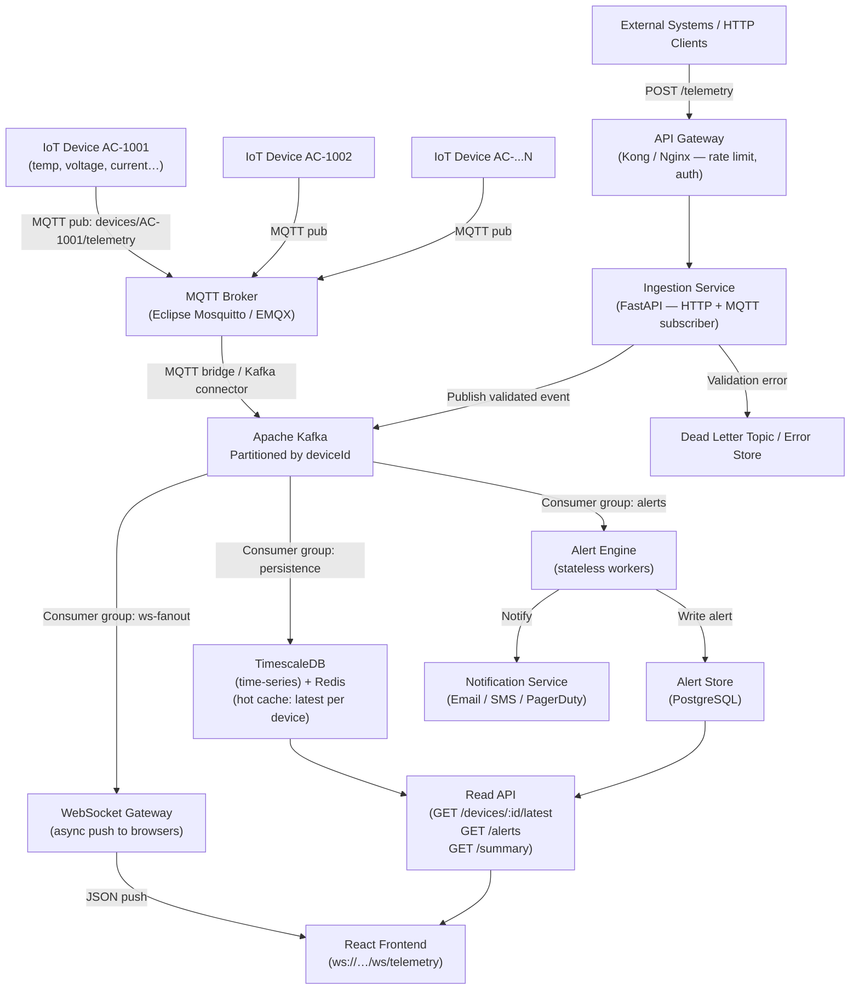

# High-Level Design (HLD) — IoT Telemetry System

## 1. System Overview

The IoT Telemetry System ingests sensor readings from thousands of IoT devices, validates and stores them, evaluates alert rules, and pushes live updates to connected frontends via WebSocket.



---

## 2. Component Responsibilities

| Component | Responsibility |
|---|---|
| **MQTT Broker (Mosquitto / EMQX)** | Accepts device connections on port 1883/8883 (TLS); routes topic-keyed messages |
| **API Gateway** | TLS termination, JWT/API-key auth, rate limiting, routing |
| **Ingestion Service** | Validates payload, publishes to Kafka; also runs an embedded MQTT subscriber for local dev |
| **Apache Kafka** | Durable ordered event log; decouples producers from all downstream consumers |
| **Persistence Consumer** | Writes to TimescaleDB; upserts Redis `latest:{deviceId}` key |
| **Alert Engine** | Stateless rule evaluation; writes alerts + triggers notifications |
| **WebSocket Gateway** | Subscribes to Kafka; fans out JSON to all connected browser clients |
| **Read API** | Low-latency reads from Redis (latest) + TimescaleDB (history/summary) |

---

## 3. Messaging Architecture — MQTT + Kafka

### 3.1 Why Two Systems?

| Concern | MQTT | Kafka |
|---|---|---|
| **Protocol** | Lightweight pub/sub for constrained IoT devices (TCP, tiny packets) | High-throughput event streaming (binary protocol, batching) |
| **Durability** | Best-effort QoS 0 or at-least-once QoS 1 | Configurable retention (days/weeks), replayable |
| **Fan-out** | One topic → one subscriber per subscription | Multiple independent consumer groups at different offsets |
| **Use** | Device → Cloud transport | Cloud-internal event bus |

### 3.2 MQTT Topic Structure

```
devices/{deviceId}/telemetry        ← sensor readings (QoS 1)
devices/{deviceId}/command          ← downstream commands to device
devices/{deviceId}/status           ← device heartbeat / LWT (Last Will)
```

- Wildcard subscriptions: `devices/+/telemetry` (single-level), `devices/#` (all)
- **Last Will & Testament**: each device registers an LWT on connect: if the TCP connection drops without a proper DISCONNECT, the broker auto-publishes `{"status":"offline"}` to `devices/{id}/status` — triggers `DEVICE_OFFLINE` alert automatically.

### 3.3 Kafka Topic Structure

```
Topic: telemetry.ingested           ← validated readings (partitioned by deviceId)
Topic: telemetry.alerts             ← alert events (fan-out to notification service)
Topic: telemetry.dlq                ← invalid/failed messages (dead letter queue)
```

Partitioning by `deviceId` guarantees ordering per device.

### 3.4 MQTT → Kafka Bridge (Production)

```
IoT Device
   │  MQTT pub  QoS 1
   ▼
EMQX Broker
   │  Kafka connector (built-in to EMQX Enterprise / external Kafka bridge)
   ▼
Kafka: telemetry.ingested
   │
   ├── Consumer: Ingestion Service  →  validate → store → alert
   ├── Consumer: Alert Engine       →  rule eval → notify
   └── Consumer: WS Gateway         →  push to browsers
```

### 3.5 Current Implementation (Docker Dev)

In this implementation, the MQTT broker (Mosquitto) runs inside Docker. The FastAPI backend has an **embedded async MQTT subscriber** setup in `main.py` that:

1. Connects to Mosquitto on `mqtt://mosquitto:1883`
2. Subscribes to `devices/+/telemetry` (QoS 1)
3. On message: parses JSON → runs through the same validation/storage/alert/WebSocket broadcast pipeline as `POST /telemetry`
4. Auto-reconnects with 5s backoff on broker restart

**Both ingestion paths (HTTP POST + MQTT) are fully active simultaneously.**

To test MQTT:
```bash
# Publish via mosquitto_pub (install: sudo apt install mosquitto-clients)
mosquitto_pub -h localhost -p 1883 \
  -t "devices/AC-1001/telemetry" \
  -m '{"deviceId":"AC-1001","timestamp":"2026-06-16T05:30:00Z","temperature":29.5,"energyConsumption":4.8,"voltage":230,"current":6.2,"status":"online"}'
```

---

## 4. Retry, Idempotency & Late Events

| Concern | Mechanism |
|---|---|
| **Duplicate events** | `UNIQUE(device_id, timestamp)` in DB; Kafka idempotent producer (`enable.idempotence=true`) |
| **Late events** | Store with original device `timestamp`; `device_latest` only updated if new timestamp ≥ existing |
| **MQTT retries** | QoS 1 — broker re-delivers until device ACKs; downstream dedup via UNIQUE constraint |
| **Kafka retries** | `acks=all`, `retries=5`; consumer commits offset only after successful processing |
| **Dead letters** | After 3 consumer retries: route to `telemetry.dlq` Kafka topic for ops investigation |
| **HTTP retries** | `409 Conflict` returned for duplicates; safe to retry entire `POST /telemetry` |

---

## 5. Error Handling & Validation Strategy

| Layer | Strategy |
|---|---|
| **Device schema** | Pydantic strict types + range validators at ingestion entry point |
| **Invalid events** | `422` with field-level errors (HTTP); log + discard (MQTT); route to DLQ (Kafka) |
| **Suspicious readings** | Stored but flagged with `SUSPICIOUS_READING` alert rule |
| **Offline devices** | `status != online` → `DEVICE_OFFLINE` alert; MQTT LWT triggers alert automatically |
| **Broker unavailable** | MQTT subscriber auto-reconnects; HTTP ingestion continues unaffected |
| **DB unavailable** | Circuit breaker (production); `503` returned to device |

---

## 6. Handling Invalid Events, Suspicious Readings & Offline Devices

```
Incoming reading
   │
   ├── Invalid schema / missing required field
   │       → reject with 422 + field errors (HTTP)
   │       → log WARN + discard (MQTT)
   │       → route to DLQ (Kafka)
   │
   ├── Valid but suspicious (voltage/current out of range)
   │       → store reading
   │       → fire SUSPICIOUS_READING alert
   │       → broadcast via WebSocket
   │
   ├── Device status = offline / error
   │       → store reading
   │       → fire DEVICE_OFFLINE alert
   │       → broadcast via WebSocket
   │
   └── Normal → store → optional alert → broadcast
```

**MQTT LWT for automatic offline detection**:
```
Device registers on connect:
  Will Topic: devices/AC-1001/status
  Will Payload: {"status": "offline", "reason": "connection_lost"}
  Will QoS: 1
  Will Retain: true

→ If TCP drops without DISCONNECT, broker publishes LWT automatically
→ Status consumer receives → fires DEVICE_OFFLINE alert
```

---

## 7. Observability

| Layer | Tool |
|---|---|
| **Structured logs** | JSON logs via Python `logging` → Loki / CloudWatch |
| **Metrics** | Prometheus `/metrics` → Grafana dashboards (request rate, alert rate, MQTT msg/s, Kafka consumer lag) |
| **Distributed tracing** | OpenTelemetry → Jaeger / Tempo (trace per reading end-to-end, includes MQTT→Kafka→DB hops) |
| **Health checks** | `/health` on ingestion service; Docker/k8s readiness probes |
| **Alerting on infra** | PagerDuty on Kafka lag > 10k msgs, MQTT broker disconnect, error rate > 1% |
| **MQTT monitoring** | EMQX dashboard — connected devices, message rate, QoS delivery stats |

---

## 8. Scaling Strategy

| Challenge | Strategy |
|---|---|
| **Thousands of devices** | EMQX scales to millions of MQTT connections on a cluster; Kafka partitions by `deviceId` |
| **High write throughput** | TimescaleDB chunks + compression; batch Kafka consumer commits (every 100ms / 500 msgs) |
| **Read scalability** | Redis `O(1)` for `/latest`; read replicas + continuous aggregates for analytics |
| **WebSocket fan-out** | Stateless WS workers (no sticky sessions); each subscribes to Kafka consumer group |
| **Alert storms** | Rate-limit: max 1 alert per rule per device per 5 min; dedup in Kafka consumer |
| **Geographic distribution** | EMQX geo-cluster + Kafka MirrorMaker 2 for cross-region replication |

---

## 9. Database Choice

| Option | Use Case |
|---|---|
| **TimescaleDB** | Default — PostgreSQL-compatible, automatic time partitioning, continuous aggregates |
| **InfluxDB** | Ultra-high write throughput (millions/sec) with Flux querying |
| **Redis** | Latest-per-device hot cache (`O(1)` reads via `HSET devices:{id}`) |
| **SQLite** | Local dev / this implementation |

---

## 10. Security

- **MQTT**: TLS on port 8883; per-device certificates or username/password; ACL per topic (each device can only publish to its own `devices/{id}/telemetry`)
- **API**: JWT/API-key auth at Gateway; rate limiting per device (1 msg/sec)
- **Kafka**: SASL/TLS between services; topic-level ACLs
- **Network**: Private VPC; backend services not directly internet-accessible
